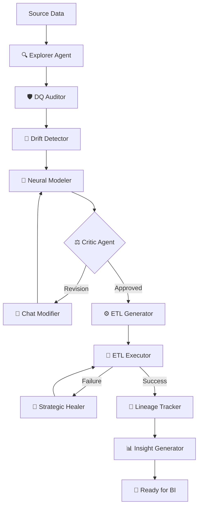

# 🌌 Agent Data Warehouse v4.0 PRO
> **L'ingénierie de données réinventée par l'Intelligence Artificielle Agentique.**

[](https://fastapi.tiangolo.com)
[](https://reactjs.org)
[](https://langchain-ai.github.io/langgraph/)
[](https://opensource.org/licenses/MIT)

**Agent Data Warehouse** est une plateforme ETL autonome de nouvelle génération. Elle utilise une orchestration multi-agents (via LangGraph) pour transformer des sources de données brutes en un Data Warehouse structuré selon la méthodologie Kimball, sans intervention humaine manuelle.

---

## ✨ Fonctionnalités d'Élite

### 🧠 Cerveau Orchestrateur (LangGraph)
Un graphe de décision complexe gère le flux de données, de l'exploration à la maintenance, avec une capacité d'auto-correction unique.

### 🏥 Système Immunitaire (Neural Healer)
Lorsqu'une erreur survient dans le pipeline ETL, l'agent **Healer** analyse les logs système et applique des remédiations stratégiques (dédoublonnage, forçage de types, insertion permissive) pour garantir un chargement réussi.

### 💓 Pulse Metrics & Real-time Monitoring
Suivez la progression de vos données en direct avec des compteurs de lignes ultra-rapides et une visualisation dynamique du débit de traitement.

### 🏛️ Architecture & Dictionnaire Neural
Génération automatique d'un schéma en étoile (Star Schema) avec documentation sémantique intégrée pour chaque entité métier.

### 📊 Neural Insights & SQL Suggestions
Analyse post-chargement par IA pour extraire la valeur métier et suggérer des requêtes SQL analytiques prêtes à l'emploi.

---

## 🏗️ Architecture du Système



---

## 🛠️ Stack Technologique

| Couche | Technologies |
|--------|--------------|
| **Intelligence** | LangGraph, Gemini 1.5 Pro / Flash, Ollama |
| **Logic** | Python 3.10+, FastAPI, SQLAlchemy |
| **Frontend** | React 18, Tailwind CSS, Framer Motion, Zustand |
| **Data Engine** | Pandas, OpenPyXL, SQL Connector |
| **Operations** | Docker, JWT Auth, Rate Limiting |

---

## 🚀 Démarrage Rapide

### 1. Configuration de l'environnement
Clonez le dépôt et configurez votre fichier `.env` :
```bash
git clone https://github.com/votre-repo/agent-data-warehouse.git
cd agent-data-warehouse
cp .env.example .env
```

### 2. Lancement via Docker (Recommandé)
Le moyen le plus simple de déployer la stack complète (Frontend, Backend, Database) :
```bash
docker-compose up --build -d
```
Accès :
- **Frontend** : `http://localhost:80`
- **Backend API** : `http://localhost:8000/docs`

### 3. Installation manuelle
**Backend :**
```bash
pip install -r requirements.txt
uvicorn api.server:app --reload --port 8000
```
**Frontend :**
```bash
npm install
npm run dev
```

---

## 📖 Méthodologie Data Engineering

Le système applique rigoureusement les principes de modélisation de Kimball :
- **Surrogate Keys** : Clés artificielles pour l'indépendance des données.
- **SCD Type 2** : Gestion de l'historique des changements (Slowly Changing Dimensions).
- **Integrité Dimensionnelle** : Résolution automatique des clés étrangères lors du chargement des faits.
- **dim_date** : Génération systématique d'une dimension temporelle enrichie.

---

## 🤝 Contribution
Les contributions sont les bienvenues ! Pour les changements majeurs, veuillez d'abord ouvrir une issue pour discuter de ce que vous aimeriez changer.

---

## 📄 Licence
Distribué sous la licence MIT. Voir `LICENSE` pour plus d'informations.

---

<p align="center">
  Propulsé par <b>Agent Architect</b> · Créé pour l'ère de l'IA.
</p>
