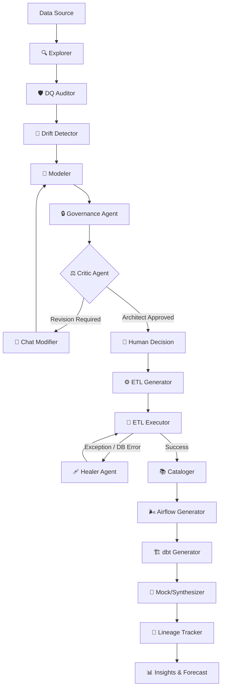

# 🌌 Agent Data Warehouse v4.1 PRO
> **L'ingénierie de données réinventée par l'Intelligence Artificielle Agentique.**

[](https://fastapi.tiangolo.com)
[](https://reactjs.org)
[](https://langchain-ai.github.io/langgraph/)
[](https://opensource.org/licenses/MIT)

**Agent Data Warehouse** est la première plateforme d'ingénierie de données totalement autonome. Propulsée par 15 agents neuronaux indépendants, elle convertit vos gisements de données bruts en un environnement décisionnel d'entreprise (Data Warehouse structuré, Modèles dbt, Orchestration Airflow, Audit de sécurité RGPD) sans écrire la moindre ligne de code manuellement.

---

## ✨ Les 15 Agents Intelligents (v4.1 PRO)

Notre architecture LangGraph orchestre des agents spécialisés qui interagissent et corrigent leurs erreurs en temps réel :

### 1️⃣ Exploration et Qualité (Source)
- **🔍 Explorer** : Analyse la topologie et le format du système source par inférence.
- **🛡️ Data Quality** : Évalue la propreté (valeurs nulles, unicité) et émet un Score de Santé.
- **🌊 Drift Detector** : Protège le pipeline contre les changements surprises du backend de production.

### 2️⃣ Architecture et Gouvernance (Conception)
- **🧠 Modeler** : Construit le schéma en étoile (Star Schema) via Méta-heuristique.
- **🔒 Governance** *(Nouveau)* : Agit comme un véritable DPO (Data Protection Officer) pour détecter les PII et générer des règles de Masquage SQL Dynamique (CCPA/RGPD).
- **⚖️ Critic** : Le garant de l'intégrité architecturale, capable de bloquer et demander des révisions au Modeler.

### 3️⃣ Interaction et Correction (Humain + IA)
- **👤 Human Review** : L'Humain garde le dernier mot via l'interface du Dashboard (HITL).
- **💬 Chat Modifier** : Prends vos requêtes en langage naturel ("Ajoute une dimension métier") et refactorise l'architecture sur le tas.

### 4️⃣ Génération, Exécution et Guérison (ETL)
- **⚙️ ETL Generator** : Encode les règles de mapping complexes en scripts XML ou Python réels.
- **🚀 ETL Executor** : Propulse les données de bout en bout via des connecteurs haute-performance.
- **🩹 Healer** : *Auto-Guérison*. Intercepte les pannes de processus ou exceptions SQL, comprend l'erreur de base de données et auto-corrige le pipeline.

### 5️⃣ Observabilité, Analyse & Modern Data Stack (Export)
- **📚 Cataloger** *(Nouveau)* : Autogénère un Dictionnaire de Données d'entreprise ultra-complet reprenant la sémantique de vos activités.
- **🌬️ Airflow Generator** *(Nouveau)* : Génère le DAG Python Apache Airflow pour planifier vos re-traitements en production.
- **🏗️ dbt Generator** *(Nouveau)* : Structure vos transformations dbt (`models/staging`, `models/marts`) directement au format .zip pré-prêt.
- **🧪 Synthesizer (Mock Data)** *(Nouveau)* : Génère massivement des instructions SQL \`INSERT\` de données sémantiquement plausibles pour tester vos dashboards sans environnement de production.
- **📊 Forecaster / Insight Generator** : Intelligence Artificielle temporelle projetant des régressions sur vos faits analytiques (Revenus, Ventes, Trafic).
- **🔗 Lineage Tracker** : Reconstruit la lignée (Data Lineage) visuelle de vos flux avec ReactFlow.

---

## 🏗️ The Neural Flow (LangGraph Architecture)



---

## 🚀 Démarrage Rapide

### Déploiement Simplifié (Vite + FastAPI + Docker)
Clonez et créez votre fichier d'environnement :
```bash
git clone https://github.com/salaheddinehalimisiad-coder/agent_data_warehouse_v2.git
cd agent_data_warehouse_v2
cp .env.example .env
```
Lancez l'intégralité du produit en `mode développement` depuis le script PowerShell (si Windows) :
```powershell
.\start.ps1
```
Ou manuellement :
```bash
# Terminal 1 - The AI Backend (Port 8000)
pip install -r requirements.txt
uvicorn api.server:app --reload

# Terminal 2 - The Neural React Dashboard (Port 5173)
npm install
npm run dev
```

---

## 🤝 Contribution & License
Cette version intègre les bests practices de Data Engineering de pointe (*Kimball Data Warehousing, SCD Type 2, PII Hashing...*). Distribué sous licence MIT. Code propriétaire initial créé dans l'ère de l'Intelligence Multi-Agents.

> *"We don't code data pipelines anymore, we govern the AI that does."*
